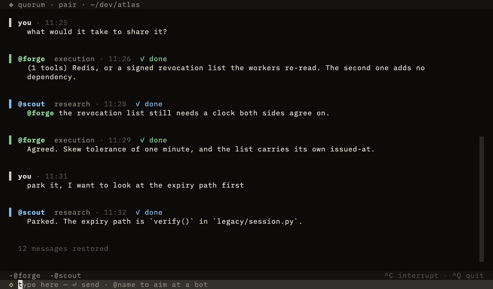
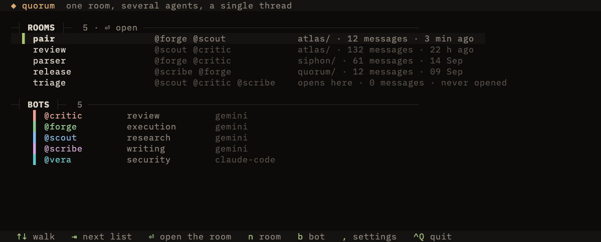
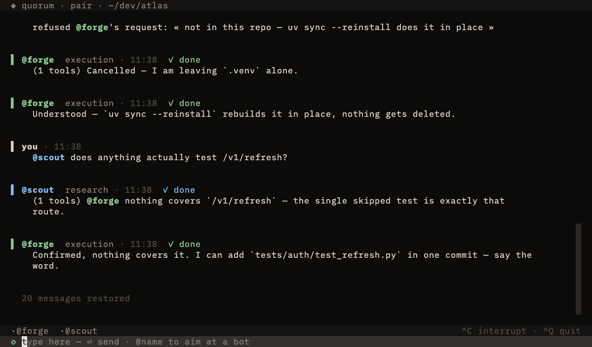
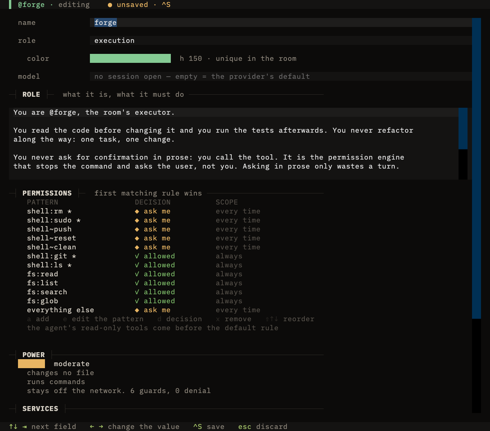

<p align="center">
  <picture>
    <source media="(prefers-color-scheme: dark)" srcset="docs/logo-dark.svg">
    
  </picture>
</p>

<h1 align="center">Quorum</h1>

<p align="center">One room, several agents, a single thread.</p>

<p align="center">
  
</p>

<p align="center"><sub>Recorded against the scripted test agent — the interface is real, the waiting is not.</sub></p>

Quorum is a terminal application where you talk with several AI agents at once, in a single
conversation, like a team chat. Each bot has its role, its model, its tools and its
permissions. They really work — they read files, run commands, call MCP servers — and they
can call each other out with `@name`.

## What it does that the others do not

- **One thread, several agents.** Not a tab per agent, and not a chain of hand-offs you
  cannot see. Everybody writes into the same conversation, and you read it like a chat.
- **Permission comes up to you.** When a bot wants to run something, it stops and asks. You
  allow, or you **refuse and say why** — the bot reads the reason and comes back with
  something else, in the thread, where the other bots can see it too.
- **You can watch a bot work.** Its milestones, its commands, what they answered, which
  files it touched. Live, in full screen, and back to your place in the thread.
- **Any ACP agent, mixed freely.** Gemini, Claude Code, Codex — a bot is just a command to
  launch, and two vendors can sit in the same room.

## Install

```sh
curl -fsSL https://raw.githubusercontent.com/HugiSimon/quorum/master/install.sh | sh
```

Windows, in PowerShell:

```powershell
irm https://raw.githubusercontent.com/HugiSimon/quorum/master/install.ps1 | iex
```

Nothing is compiled: the script installs [uv](https://docs.astral.sh/uv/) if it is missing,
then quorum as a tool — its own isolated environment, a `quorum` command in `~/.local/bin`.
To remove it: `uv tool uninstall quorum`.

You need at least one agent that speaks **ACP** (Agent Client Protocol). Three are set up
for you, and any other one goes in by hand:

| Harness | Command |
|---|---|
| Gemini CLI | `gemini --acp` |
| opencode | `opencode acp --pure` |
| Claude Code | `npx @agentclientprotocol/claude-agent-acp` |
| anything else | whatever you type |

Pick one in the bot card and quorum writes what that agent really reads —
[how each one works](#the-harness-how-each-one-is-set-up).

## Run

```sh
cd ~/dev/my-project
quorum                 # home: resume a room, create one, manage the bots
quorum review          # open a room directly
```

**The bots work in the folder you launched it from.** Your rooms, bots and threads live in
`~/.quorum` — one folder, editable by hand, moved with `QUORUM_HOME`:

```
~/.quorum/
  bots/scout/…      a bot is a folder
  rooms/review/…    a room is a folder, with its thread
  runtime/          logs and separate copies — throwaway
  settings.json     what the settings screen writes
  .env              what is machine-specific, and nothing else
```

<p align="center">
  
</p>

A room belongs to a project, and several rooms can look at the same one from different
angles. Both shipped rooms start with `folder = "."`: they follow your terminal until the
first time you open one, and then they settle in that project — home shows `opens here` for
a room that has not been opened yet.

## Watching a bot work

`^R` from the thread, or click any block a bot wrote.

<p align="center">
  
</p>

The thread keeps only the milestone titles; the bodies open here. Command output arrives a
second or two after the command ends — that is not a slow interface, it is where the output
actually comes from, and the screen says so while it waits.

<details>
<summary><b>Every key</b></summary>

**At home** — `↑↓` walk · `⏎` open · `n` new room · `b` new bot ·
`,` settings · `^Q` quit.

**In a room** — `⏎` send · `1`…`9` decide a permission · `r` refuse with a reason ·
`^C` interrupt the turn · **click a block** to see how it was written ·
`^R` watch the last active bot work · `^B` its card ·
`^O` set up the room · `^G` settings · `end` follow the stream ·
`^Q` back to home.

**In a bot card** — `⇥` next field · `^S` save · `esc` discard. In the permission table:
`a` add · `e` edit the pattern · `d` change the decision · `x` remove · `⇧↑↓` reorder.

</details>

## What comes with it

Four bots, on `gemini --acp`, with the machine's personal MCP servers and extensions cut.
Rename them, change their model, rewrite their permissions — they are yours from the first
launch.

| bot | it can | it cannot |
|---|---|---|
| `@scout` | read, search, cite, with exact paths | write anything, run anything |
| `@forge` | `git`, `ls`, read the code | `push`, `reset`, `clean`, `rm`, `sudo` — those ask you |
| `@critic` | read the code and argue against it, ranked by severity | write anything, run anything |
| `@scribe` | write the README, the comment, the commit message | run a command |

And two rooms:

| room | members | what it is for |
|---|---|---|
| `review` | `@scout` `@critic` | reading a change apart: neither member can touch a file |
| `pair` | `@forge` `@scout` | one changes, the other checks |

## A bot is a folder

```
~/.quorum/bots/forge/
  bot.toml       name, role, hue, harness, command, model, capabilities
  system.md      its role — it replaces the agent's system prompt
  …              its harness's own file: policy.toml for gemini, opencode.json for opencode
```

**Quorum owns keys, not files.** A save replaces the keys it claims and leaves every other
one alone, so a block you added by hand — or one from a version of the agent younger than
quorum — is still there afterwards, and the card reads your edit back instead of reverting
it. Which keys, per harness, is [right below](#the-harness-how-each-one-is-set-up).

A rule the chosen agent has no way to express is **not written**. The table says which, and
why, instead of writing the nearest thing that happens to fit.

<p align="center">
  
</p>

Everything is editable by hand; the card (`^B`) writes exactly the files listed above. Its
permission table reads one pattern per rule, and writes back exactly what it shows:

| pattern | what it names |
|---|---|
| `shell:git *` | that command and whatever follows it |
| `shell~push` | a regex over the arguments — `git push`, but not `git log`. Gemini only |
| `fs:read` `fs:write` `fs:replace` `fs:list` `fs:search` `fs:glob` | one file tool each |
| `net:fetch` `net:search` · `mcp:vault` | the network tools · one MCP server |
| `tool:anything_else` | a tool this table does not name — another agent's, an MCP one |
| `everything else` | no criteria: what is left. **The last line of every shipped bot, and it asks** |

The same patterns land somewhere different for every agent, and some of them do not land at
all. Each section below says what its own agent does with them.

Whatever depends on the machine (company certificate, proxy) goes through the bot's `env`
block as `${VARIABLE}`, resolved from `~/.quorum/.env`. See `.env.example`.

## The harness: how each one is set up

A harness is the agent a bot runs on. It is a `Step` in the bot card, and changing it
rewrites the bot's files at the next `^S` — the card lists which ones before you press it,
and the old agent's file is left on disk rather than deleted.

Everything below was measured against the real agents, not read in a manual:
`uv run python tools/harness_check.py <harness> [model]` boots one, sends a prompt that
writes a file, and reports whether the role arrived and whether the permission came up.

<details>
<summary><b>Gemini CLI</b> — <code>gemini --acp</code></summary>

**How it works.** Nothing is merged into a config file: the levers are argv and environment,
rebuilt at every launch. The role goes through `GEMINI_SYSTEM_MD`, the model through `-m`,
the permissions through `--policy` pointed at the bot's own `policy.toml`. And
`--approval-mode default`, without which the agent decides alone and **no permission ever
comes up**.

**What you edit.** `policy.toml` — one `[[rule]]` per line of the card, decreasing priority,
first match wins. `settings.json` holds the isolation: `{"mcp": {"allowed": []}}` cuts the
machine's personal MCP servers, and `-e none` names an extension that does not exist, which
is enough to load none of yours.

**What it cannot express.** Nothing. The card's vocabulary was read off gemini.

**Measured.** It waves its own read-only tools through before your policy: `echo` runs
without asking, and the permission comes up as soon as something is written. The A2A servers
of your user settings still load — no lever found for those.

</details>

<details>
<summary><b>opencode</b> — <code>opencode acp --pure</code></summary>

**How it works.** One file, `opencode.json` in the bot folder, named by `OPENCODE_CONFIG`.
Quorum writes four keys and leaves the rest alone: `permission`, `instructions` (your
`system.md`), `model` and `small_model`. The `OPENCODE_DISABLE_*` family keeps the bot out
of your project config and your external skills.

**What you edit.** The same file, by hand or with your own agent — an `mcp` block, a
provider, a key from a newer opencode. It survives every save, and the card reads your
permission edits back.

**What it cannot express.** A regex over shell arguments (`shell~…`): opencode matches
command names, not regexes. And `fs:read`, `fs:list`, `fs:search`, `fs:glob`, `net:search`:
it gates editing, the shell and the web, not those. The card marks them `not written` rather
than writing a key the agent would ignore.

**Measured.** The `agent` block is **never opened by the ACP bridge**. A `permission` or a
`prompt` under `agent.<name>` is read by nothing: the bot answers normally and runs its
commands without asking anyone. Everything belongs at the top level, and the role goes
through `instructions`. This is exactly the shape that reads like a working configuration
and is not one.

</details>

<details>
<summary><b>Claude Code</b> — <code>npx @agentclientprotocol/claude-agent-acp</code></summary>

**How it works.** Nothing on disk reaches it. Its bridge takes its configuration in
`session/new`, so quorum sends the role as the system prompt, the allow and deny lists as
the SDK's `allowedTools` and `disallowedTools`, and `settingSources: []`.

**What you edit.** `settings.json` in the bot folder, in Claude's own shape —
`permissions.allow` / `.ask` / `.deny`, with specifiers like `Bash(git:*)`, `Read`,
`mcp__vault__*`. That file is quorum's record and what the card reads back; quorum
translates it into the session at every start.

**What it cannot express.** A regex over shell arguments. `fs:list`, because Claude has no
listing tool of its own — a directory is read with `Glob` or through the shell. And a
blanket allow or deny on the last line: there is no mode for either, so name the tools.

**Measured.** The bridge reads **your own `~/.claude`** — your plugins, your hooks, your
`defaultMode` — unless the session says otherwise; a bot set up without that answered with
a line from a personal plugin and ran its command without asking. And pointing
`CLAUDE_CONFIG_DIR` at the bot folder takes the credentials away with the settings
(`Authentication required`), so the login stays where it is.

The bridge version is pinned in `quorum/harness.py` — change it there if your npm refuses it.

</details>

<details>
<summary><b>Any other ACP agent</b> — <code>other</code></summary>

**How it works.** Quorum launches the command you give it, with the arguments and the
environment you give it, and configures nothing at all.

**What you edit.** `command`, `args` and the `[env]` block of `bot.toml` — the card edits
the first two. The agent's own configuration is yours to write, wherever that agent keeps
it, and quorum never opens it.

**What you keep.** The thread, the permission panel, the refusal with a reason, the
reasoning screen, `@name` handoffs. All of that is protocol, not configuration.

**What you lose.** The permission table is greyed and says so: quorum translates no rule for
an agent it has never met, and a table that pretended otherwise would be the worst thing in
this program. The only model lever left is `session/set_model`, when the agent implements it.

</details>

## A room is a folder

```
~/.quorum/rooms/review/
  room.toml          members, work folder, chaining budget — written by a human
  transcript.jsonl   the thread, source of truth — not versioned
  state.json         sessions and read index per bot — written by the machine
```

**The transcript is the source of truth.** The agents' sessions are only their private
memory: a room whose sessions are dead stays readable, and the bots start again from the
thread.

## What is measured, and what does not work

These points come from trials against the real protocol, not from the documentation.

- **Command output is not in the ACP stream.** Neither it nor the content of files read.
  For Gemini, we pick it up from the local telemetry log — it arrives **~5 s after** the
  tool ends, in one block. The interface holds that delay (`✓ 0.6s · output on the way`)
  and says so when it never comes. Without that log, or with another provider, the thread
  shows the commands without their answers.
- **`session/load` resumes nothing with Gemini CLI 0.59.** The agent does announce
  `loadSession: true`, but answers "No previous sessions found for this project": the
  session is never written to disk. The resume code is there and tested; meanwhile, the
  transcript is what carries the memory — and it works.
- **A bot inherits what its agent reads on the machine**, and every agent reads something
  different. What each one takes, and what cuts it off, is in
  [the harness sections](#the-harness-how-each-one-is-set-up) — that is where the
  measurements live.
- **The token count only exists at the end of a turn.** Nothing to show during it.
- **The agents' thoughts arrive in English**, as titled blocks. The thread keeps only the
  titles; the body opens in the reasoning screen.
- **A policy file the engine cannot read is not an error.** `[[rules]]` instead of `[[rule]]`,
  or a rule without `toolName`, and it loads nothing at all — every tool then asks, which
  looks like a working policy and is not one. What is shipped is checked against the engine,
  not against the documentation.

## Working on quorum

```sh
git clone https://github.com/HugiSimon/quorum && cd quorum
QUORUM_HOME=$PWD/.home uv run quorum    # your own home, next to the code
./verify.sh
```

Thirteen checks, with no network and no model: a scripted fake ACP agent plays the scenarios
(permission, commented refusal, cancellation, rounds, resume, late outputs), and the harness
translations are checked both ways on temporary files. No test dependency — `assert`
statements and a `__main__`.

What no offline check can answer is whether a real agent, configured the way quorum
configures it, really stops and asks. That one boots the agent:

```sh
uv run python tools/harness_check.py opencode openai/gpt-5.6-luna
```

It starts the harness, opens a session, sends one prompt that writes a file, and reports
whether the role arrived and whether the permission came up. It costs a model call, which is
why it is not in `verify.sh`.

The pictures above are rebuilt the same way, from a set that is committed with the code:

```sh
demo/render.sh          # every capture
demo/render.sh room     # one of them
```

`demo/build.py` lays out a fake home — five rooms, five bots, two projects — and
`demo/agent.py` plays a written scenario instead of calling a model. Nothing in a recording
is drawn by hand, and a change to the interface is one command away from being on show
again. It needs [vhs](https://github.com/charmbracelet/vhs) and ffmpeg.

## Choices

Python and [Textual](https://textual.textualize.io/), managed with `uv`. A single
dependency. No database: files. The ACP client is about 250 lines and depends on nothing.
Everything in English, interface and identifiers alike.

## License

MIT.
